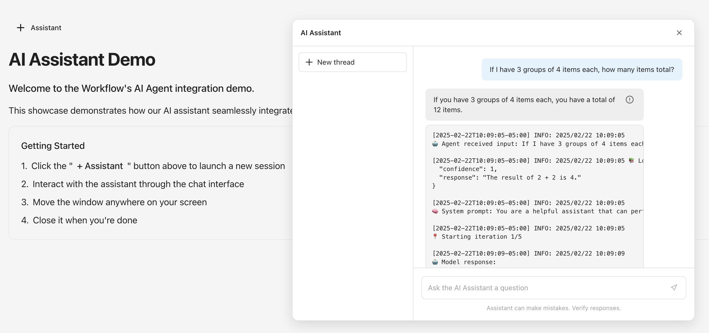

# AI Assistant Client

An AI Assistant interface built with Next.js that connects to a local AI server/agent. The assistant provides an intuitive chat interface with debug information support.

## Interface



*AI Assistant interface showing the chat window with debug information panel*

## Features

- 🤖 Real-time AI chat interface
- 🎯 Draggable window positioning
- 🔍 Debug information panel
- 💬 Conversation thread management
- ⚡ Fast response times
- 🔄 Loading states and animations

## Prerequisites

- Node.js 18.x or higher
- npm or yarn
- Running AI server (default: `http://localhost:8080`)

## Getting Started

1. Clone the repository:
   ```bash
   git clone https://github.com/popand/assistant-client.git
   cd assistant-client
   ```

2. Install dependencies:
   ```bash
   npm install
   ```

3. Set up environment variables:
   ```bash
   cp .env.example .env
   ```
   Edit `.env` file and adjust the `NEXT_PUBLIC_API_URL` if your AI server runs on a different URL.

4. Start the development server:
   ```bash
   npm run dev
   ```

5. Open [http://localhost:3000](http://localhost:3000) in your browser

## API Integration

The assistant connects to an AI server endpoint (configurable via `NEXT_PUBLIC_API_URL`):

```typescript
POST ${NEXT_PUBLIC_API_URL}/execute
Content-Type: application/json

{
  "input": "Your question here",
  "debug": true
}
```

Response format:
```json
{
  "result": {
    "final_output": {
      "confidence": number,
      "response": string
    },
    "steps": [
      {
        "action": string,
        "input": object,
        "output": object,
        "timestamp": number
      }
    ]
  },
  "debug": [
    {
      "timestamp": string,
      "level": string,
      "message": string
    }
  ]
}
```

## Project Structure

```
src/
├── app/
│   ├── api/
│   │   └── execute/
│   │       └── route.ts    # API route handler
│   │   ├── page.tsx            # Main page component
│   │   ├── layout.tsx          # Root layout
│   │   └── globals.css         # Global styles
│   ├── components/
│   │   ├── AIAssistant.tsx     # AI Assistant component
│   │   └── AIAssistant.css     # Component styles
```

## Features in Detail

### Draggable Window
- Click and drag the header to move the assistant window
- Window stays within viewport bounds
- Smooth dragging animation

### Debug Information
- Click the info icon on any assistant message
- View detailed debug logs
- Includes timestamps and execution steps

### Thread Management
- Start new conversation threads
- Clear conversation history
- Automatic scroll to latest message

## Development

### Available Scripts

- `npm run dev` - Start development server
- `npm run build` - Build for production
- `npm start` - Start production server
- `npm run lint` - Run ESLint

### Environment Variables

| Variable | Description | Default |
|----------|-------------|---------|
| `NEXT_PUBLIC_API_URL` | URL of the AI server | `http://localhost:8080` |

To configure the environment:
1. Copy `.env.example` to `.env`
2. Adjust the variables as needed
3. Restart the development server if it's running

## Contributing

1. Fork the repository
2. Create your feature branch (`git checkout -b feature/amazing-feature`)
3. Commit your changes (`git commit -m 'Add some amazing feature'`)
4. Push to the branch (`git push origin feature/amazing-feature`)
5. Open a Pull Request

## License

This project is licensed under the MIT License.